#### Данный репозиторий является pet-проектом, который представляет сервис для менеджеров компаний, владеющих своим автопарком. ####

Стек технологий и инструментов, применяемый при разработке проекта: 
- Java
- Spring Boot 3.x, Spring Security
- Hibernate, PostgreSQL с диалектом PostGis
- HTML, Thymeleaf, Bootstrap
- Postman, cURL
- Docker, docker compose, nginx, certbot
- JUnit, Cypress (e2e тестирование), H2
- github actions (CI/CD)


**Краткое содержание:**
[Запуск проекта](#deploy)
[Обзор приложения](#deploy)
[REST API](#api)
[Telegram Bot](#bot)
[Документация](#doc)

<a name="deploy"></a> 
**Запуск проекта**

С использованием **docker** контейнеров можно запустить приложение локально. Для этого необходимо выполнить следующие команды в терминале:

1. Создаем рабочую директорию с именем  **autopark**, переходим в нее и клонируем репозиторий:

```
mkdir autopark
cd autopark
git clone https://github.com/tatyana86/autopark.git
```
2. Далее можно запустить контейнеры с приложением, базой данных **Postgresql** (данные будут созданы автоматически) и прокси-сервером **nginx**:

```
docker-compose -f docker-compose.local.yml up -d --build
```
3. Готово. По [адресу](http://localhost/auth/login "http://localhost/auth/login") появится окно авторизации.


<a name="review"></a> 
**Обзор приложения**

- Авторизация

Перед началом работы на сайте необходимо ввести логин и пароль. В случае успешной авторизации менеджеру станет доступен функционал приложения.

  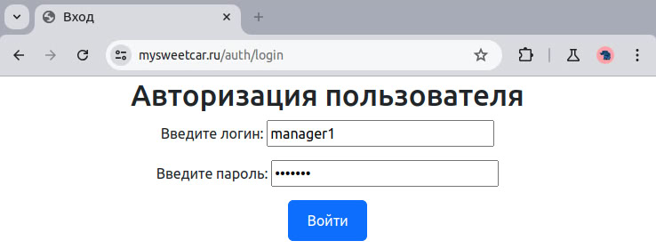

- Список предприятий

За каждым менеджером закреплены разные предприятия. У предприятия может быть несколько менеджеров (**Many to Many**):

  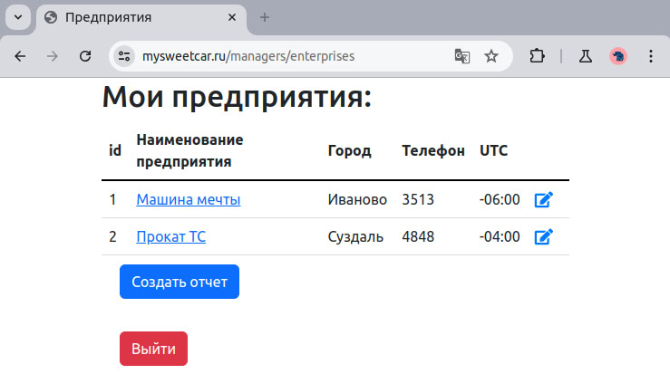

Менеджер может изменить данные предприятия:

  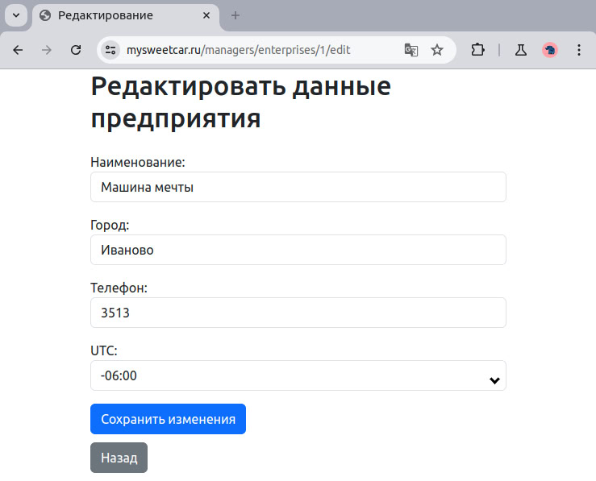

- Список автомобилей

Каждое предприятие владеет собственным автопарком (**One To Many**):

  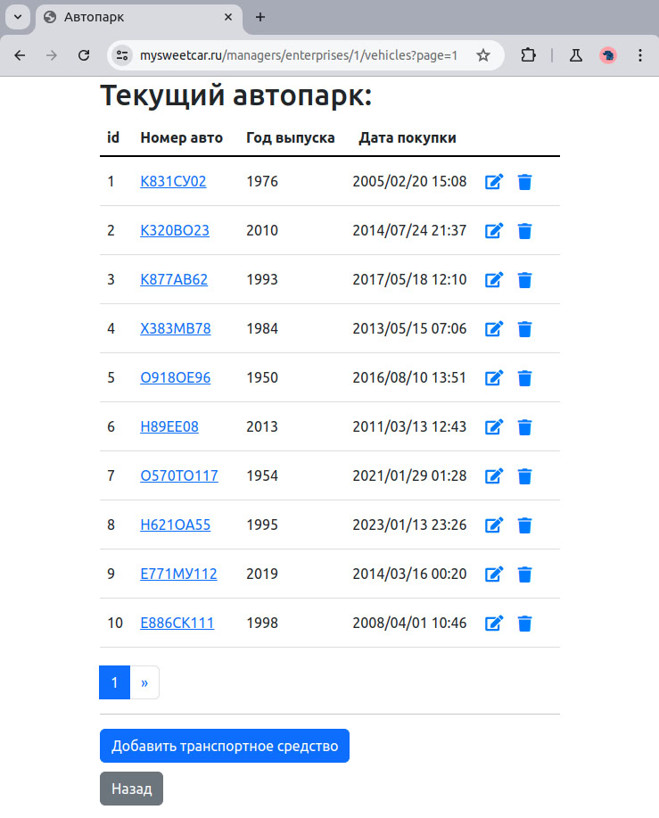

Для сущности "Автомобиль" менеджеру доступны все CRUD операции. Форма создания автомобиля с валидацией полей:

  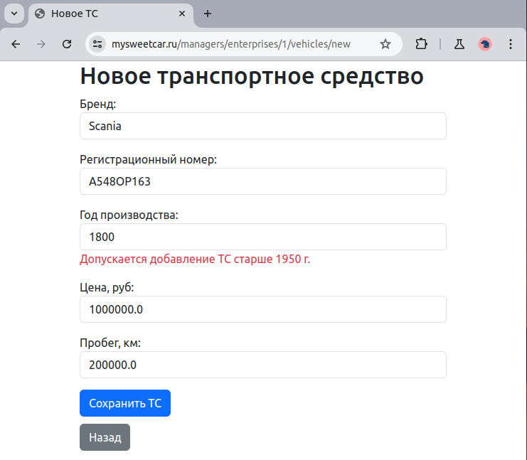

- Поездки

При выборе автомобиля отображается подробная информация о нем, а также совершенные поездки за выбранный период (по умолчанию - за последний месяц).

  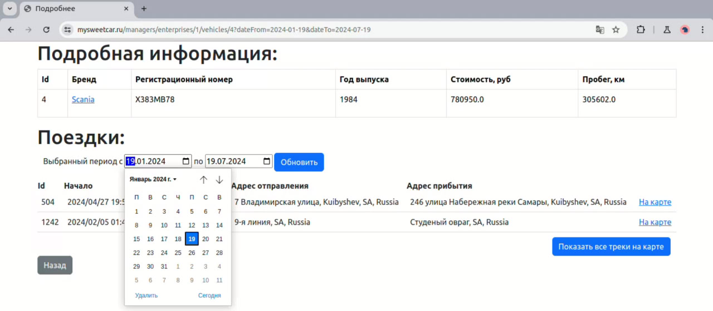

Есть возможность отобразить маршрут одной поездки (или сразу всех) на карте:

  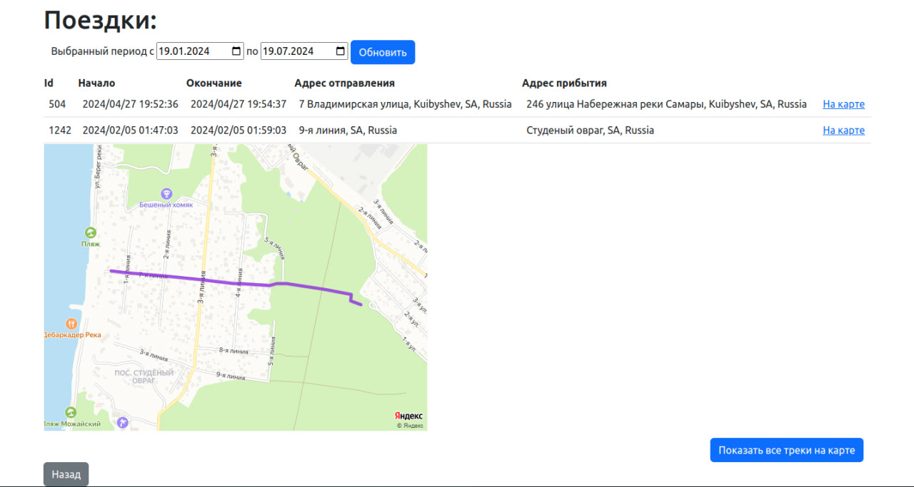

- Отчет

После успешной авторизации менеджеру также доступно создание отчета. В выпадающих списках необходимо выбрать автомобиль (из всех, что закреплены за предприятиями текущего пользователя), тип отчета и, в данном случае, указать за какой период будет подсчитан пробег (по дням или по месяцам). В заключении нужно указать интересуемый период. 

  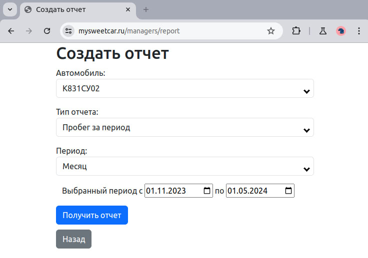

Готовый отчет содержит пробег автомобиля с периодичностью "месяц" в выбранном периоде:

  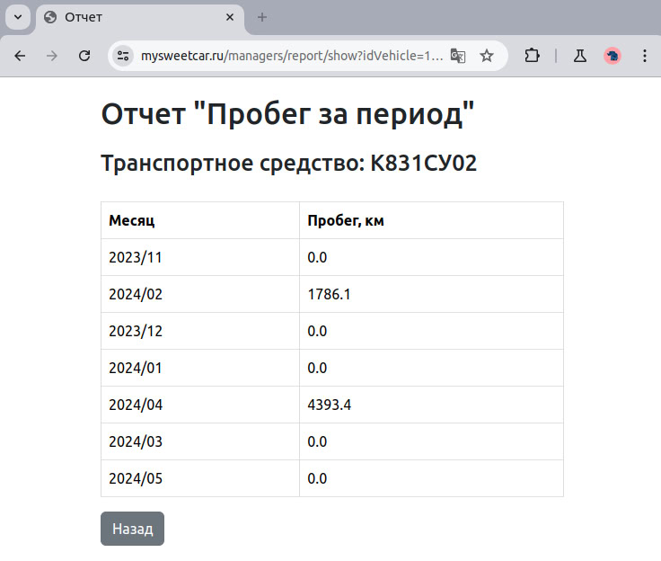

При выборе ТС можно получить отчет, в котором хранятся все поездки за выбранный период времени с возможностью отобразить маршруты на карте.

<a name="api"></a> 
**REST API**

Все основные CRUD операции, приведенные выше, доступны также через запросы с конечным точкам. Например, получение отчета в формате json для автомобиля с id=1 и заданным периодом:

  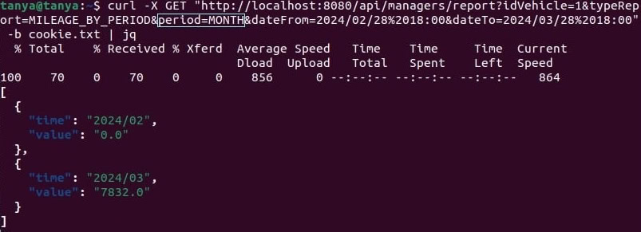

<a name="bot"></a> 
**Telegram Bot**

В рамках проекта создан телеграм-бот, позволяющий получить отчет после успешной авторизации:

  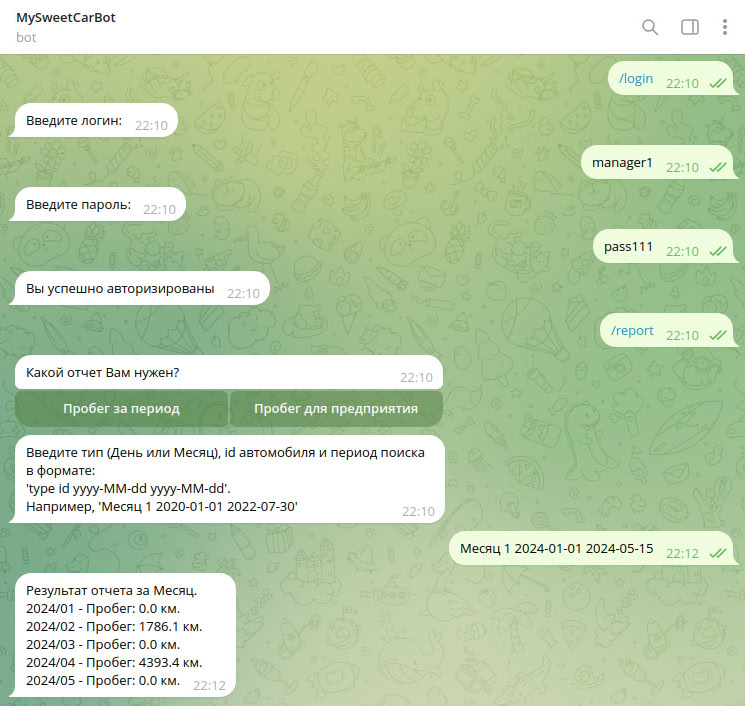


<a name="doc"></a> 
**Документация**

Для отдельных контроллеров была создана документация с использованием Swager:

  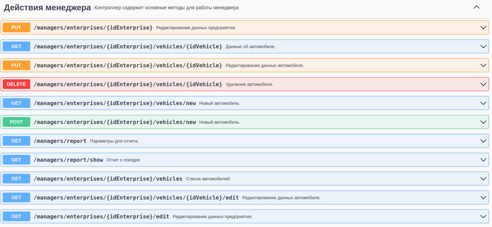

Более подробно можно посмотреть [здесь](https://mysweetcar.ru/swagger-ui/index.html "онлайн-документация").